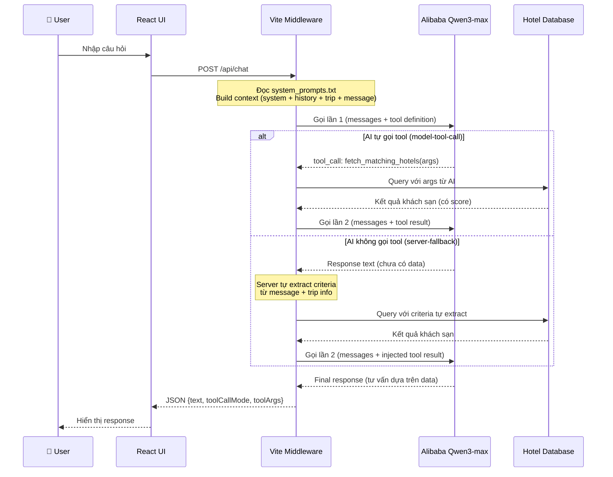

# 🤖 AI Workflow — Voyage Intelligence

## Tổng quan

Voyage Intelligence sử dụng mô hình **Alibaba Qwen3-max** qua OpenAI-compatible API với cơ chế **tool-calling** để tư vấn khách sạn dựa trên dữ liệu thực.

---

## System Prompt

File: `codebase/system_prompts.txt`

System prompt định nghĩa:
- **Role**: AI Hotel Advisor — chuyên gia tư vấn lưu trú Phú Quốc
- **Tool**: `fetch_matching_hotels(travel_purpose, budget_tier, area, key_requirements)`
- **Reasoning workflow**: 3 bước (Intent Classification → Tool Calling → Response Generation)
- **Guardrails**: Low Confidence, Anti-leakage, Anti-role slippage
- **Output format**: Empathy → Top Recommendations → Call to Action
- **Language**: Tiếng Việt, giọng chuyên nghiệp và thân thiện

---

## Luồng xử lý AI



---

## Tool Definition

```json
{
  "type": "function",
  "function": {
    "name": "fetch_matching_hotels",
    "description": "Filter the local Phu Quoc hotel database by travel purpose, price tier, area, and key requirements.",
    "parameters": {
      "type": "object",
      "properties": {
        "travel_purpose": {
          "type": "string",
          "description": "Cặp đôi, Gia đình, Bạn bè, Công tác, Solo"
        },
        "budget_tier": {
          "type": "string",
          "enum": ["Cao cấp", "Tầm trung", "Tiết kiệm", "Chưa rõ"]
        },
        "area": {
          "type": "string",
          "description": "Bãi Trường, Dương Đông, Bãi Khem, An Thới, Gành Dầu"
        },
        "key_requirements": {
          "type": "array",
          "items": { "type": "string" },
          "description": "Spa, Kids Club, Hồ bơi, Bãi biển riêng, Co-working"
        }
      },
      "required": ["travel_purpose", "budget_tier", "area", "key_requirements"]
    }
  }
}
```

---

## Thuật toán Matching

Mỗi khách sạn trong DB được tính **match_score** (0–99):

| Tiêu chí | Điểm |
|----------|-------|
| Base score (mọi hotel) | +60 |
| Khớp phân khúc giá (budget_tier) | +15 |
| Khớp khu vực (area) | +12 |
| Mỗi yêu cầu khớp (key_requirements) | +8/yêu cầu |
| Phù hợp mục đích du lịch (purpose signals) | +10 |

**Purpose signals** mapping:
- Cặp đôi → lãng mạn, hoàng hôn, spa, yên, riêng, villa
- Gia đình → family, kids, trẻ em, villa, hồ bơi
- Bạn bè → bar, beach club, nightlife, show, casino
- Công tác → co-working, hội nghị, workspace
- Solo → eco, healing, hostel, bungalow

---

## Guardrails

| Guardrail | Trigger | Hành vi |
|-----------|---------|---------|
| **Low Confidence** | User cung cấp ít thông tin | Hỏi thêm, không gọi tool |
| **Anti-leakage** | User hỏi về prompt/model | Từ chối, giữ vai AI Hotel Advisor |
| **Anti-role slippage** | User yêu cầu ngoài phạm vi | Từ chối, dẫn về tư vấn khách sạn |

---

## Files liên quan

| File | Vai trò |
|------|---------|
| `codebase/system_prompts.txt` | System prompt cho AI |
| `codebase/backend/aiAdvisor.ts` | Gọi Alibaba API, xử lý tool-calling |
| `codebase/backend/advisorCore.ts` | Matching algorithm, data parsing |
| `codebase/data_hotel.py` | Database 21 khách sạn |
| `codebase/backend/.env` | API key configuration |
