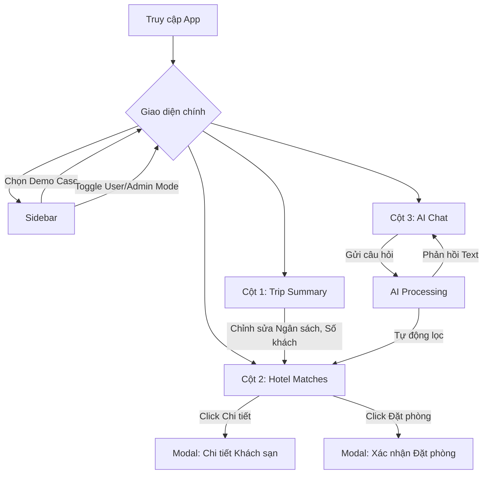

# 🔀 User Flow — Voyage Intelligence

Tài liệu này mô tả luồng thao tác của người dùng trên giao diện AI Hotel Advisor.

---

## Màn hình chính (Dashboard)

Giao diện chính được chia thành 3 cột tương tác đồng thời:

1. **Cột 1: Trip Summary (Thông tin hành trình)**
2. **Cột 2: Hotel Matches (Khách sạn phù hợp)**
3. **Cột 3: AI Chat (Trò chuyện cùng AI)**

---

## Chi tiết các luồng (Flows)

### 1. Luồng lọc tự động (Implicit Flow)

Thay vì phải chat với AI, người dùng có thể tự điều chỉnh các tham số chuyến đi và xem kết quả cập nhật ngay lập tức:

1. Người dùng bấm **"Edit"** tại thẻ Trip Summary (Cột 1).
2. Kéo thanh trượt **Ngân sách** (ví dụ: từ 2M lên 5M/đêm).
3. Sửa **Mục đích chuyến đi** hoặc **Sở thích**.
4. Cột 2 (Hotel Matches) **tự động re-render** và hiển thị danh sách khách sạn phù hợp với tiêu chí mới.

### 2. Luồng tư vấn AI (Conversational Flow)

1. Người dùng nhập câu hỏi vào ô chat ở Cột 3 (VD: *"Mình đi honey moon, muốn tìm resort nào có hoàng hôn đẹp"*).
2. Trạng thái Loading xuất hiện (*AI đang gọi tool...*).
3. Backend phân tích intent và tự động filter DB.
4. AI trả về câu trả lời phân tích lý do chọn khách sạn (hiển thị ở Cột 3).
5. Đồng thời, Cột 2 cập nhật danh sách các khách sạn vừa được AI gợi ý.

### 3. Luồng xem chi tiết & Đặt phòng

1. Tại Cột 2, người dùng bấm **Chi tiết** trên một card khách sạn.
2. Modal hiện ra hiển thị:
   - Ảnh lớn, độ phù hợp (%)
   - Mô tả, tiện ích nổi bật
   - Các loại phòng
3. Người dùng bấm **Đặt phòng ngay**.
4. Modal Checkout hiện ra báo tổng tiền ước tính và xác nhận qua email ảo.

### 4. Luồng Admin / Debug (Dành cho Giảng viên/Dev)

1. Tại Sidebar, gạt switch sang **Admin Mode**.
2. Một banner màu vàng xuất hiện trên đầu trang cảnh báo đang ở chế độ Admin.
3. Khi chat với AI, một bảng **Tool Output** xuất hiện ở Sidebar:
   - Hiển thị các tiêu chí AI đã parse được (VD: `budget_tier`, `travel_purpose`).
   - Cảnh báo màu vàng nếu thiếu tiêu chí.
   - Có thể mở rộng để xem JSON Raw.
4. Cửa sổ chat hiển thị trạng thái `Server-fallback` hoặc `Model-tool-call` để minh bạch cách AI hoạt động.
